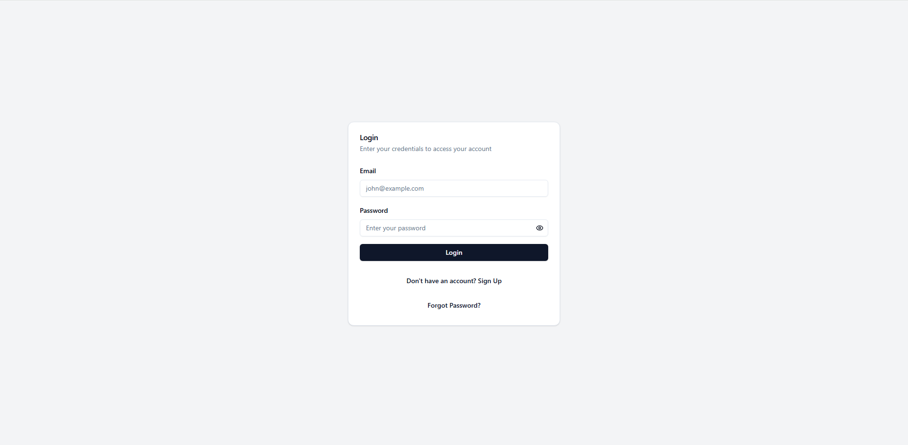
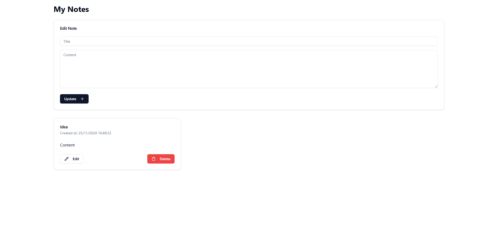
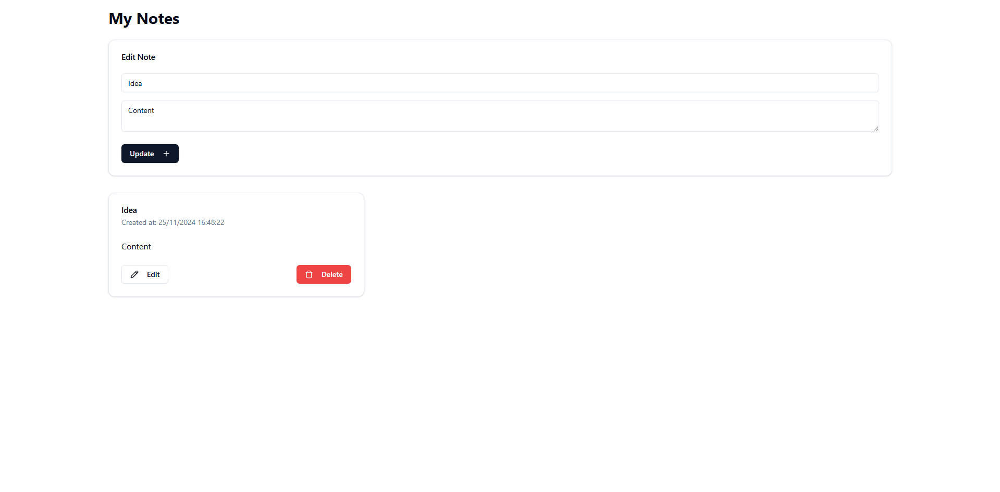

# 🌟 QuickNotes-API


**QuickNotes-API** is a simple and secure online notepad application. It allows users to create, edit, and delete private notes that are accessible anytime, anywhere. 

---

## 🚀 Features

- 🔒 **Authentication**: Secure login and registration system using JWT.
- 🗒️ **Private Notes**: Notes are private to each user and can be managed easily.
- ➕ **Add Notes**: Create as many notes as you like.
- ✏️ **Edit Notes**: Modify your notes effortlessly.
- 🗑️ **Delete Notes**: Remove notes you no longer need.

---

## 🛠️ Tech Stack

- 
- 
- 
- 

---

## 🌐 Local Setup

### Prerequisites

- **Node.js** (v16 or higher)
- **npm** or **yarn**

### Backend (API Server)

1. Navigate to the `back` directory:
   ```bash
   cd back
   ```
2. Install dependencies:
   ```bash
   npm install
   ```
3. Start the server:
   ```bash
   npm start
   ```
   The server runs at `http://localhost:5000`.

### Frontend (React Application)

1. Navigate to the `front` directory:
   ```bash
   cd front
   ```
2. Install dependencies:
   ```bash
   npm install
   ```
3. Start the development server:
   ```bash
   npm run dev
   ```
   The React application runs at `http://localhost:5173`.

---

## 📂 Project Structure

```plaintext
QuickNotes-API
├── back                    # Backend (Node.js + Express)
│   ├── middleware          # Middleware for request handling
│   ├── models              # MongoDB models
│   ├── node_modules        # Backend dependencies
│   ├── routes              # API endpoints
│   ├── utils               # Utility functions
│   ├── package.json        # Backend project dependencies
│   ├── package-lock.json   # Backend lockfile
│   └── server.js           # Server setup
└── front                   # Frontend (ReactJS)
    ├── components.json     # Shadcn component library config
    ├── eslint.config.js    # Linting configuration
    ├── index.html          # Entry point HTML
    ├── node_modules        # Frontend dependencies
    ├── package.json        # Frontend project dependencies
    ├── package-lock.json   # Frontend lockfile
    ├── postcss.config.js   # PostCSS configuration
    ├── public              # Public assets
    ├── src                 # React source files
    ├── tailwind.config.js  # TailwindCSS configuration
    ├── tsconfig.app.json   # TypeScript app config
    ├── tsconfig.json       # TypeScript root config
    ├── tsconfig.node.json  # TypeScript node config
    └── vite.config.js      # Vite configuration
```

---

## 🖼️ Screenshots

👉 **Insert your screenshots here** to showcase the user experience and features.

- **Login Page**


- **Note Dashboard**


- **Edit Note Form**


---

## 📧 Contact

If you have any questions or need assistance, feel free to reach out!

---
## ✨ Author

- [Baptiste Moreau](https://github.com/BxptisteM)
